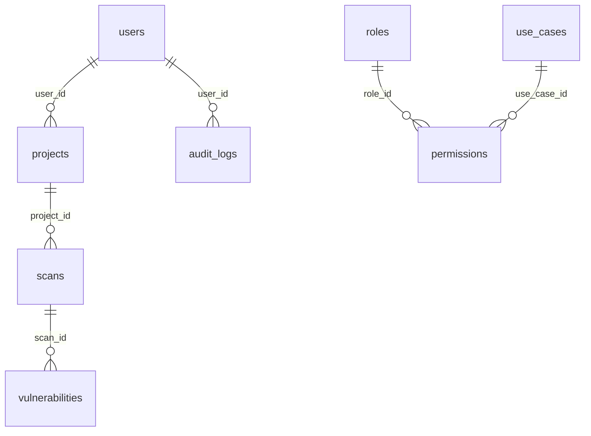

# VulnCentral

# 🏗️ Plataforma base (Fase 1): estructura de repositorio, Docker Compose, servicios mínimos sin lógica de negocio.

## Requisitos


| Herramienta                           | Comprobación                                 |
| ------------------------------------- | -------------------------------------------- |
| Docker Engine + Compose v2            | `docker --version`, `docker compose version` |
| Python 3.12 (tests locales del API)   | `python --version`                           |
| Node.js 20 (build local del frontend) | `node --version`                             |


## Inicio rápido

1. Copiar variables de entorno:
  ```bash
   cp .env.example .env
  ```
   Edita `.env` y cambia contraseñas y secretos.
2. Levantar el stack en desarrollo:
  ```bash
   docker compose up --build
  ```
3. Comprobar servicios:
  - Frontend: [http://localhost:80](http://localhost:80) (o el puerto mapeado si cambias el compose)
  - API: [http://localhost:8000/health](http://localhost:8000/health) (puerto por defecto `API_GATEWAY_PORT`)
  - RabbitMQ Management: [http://localhost:15672](http://localhost:15672) (usuario/clave según `.env`)
  - pgAdmin: [http://localhost:5050](http://localhost:5050) (puerto `PGADMIN_PORT`; email/clave `PGADMIN_DEFAULT_*` en `.env`). Al registrar el servidor usa host `**postgres**`, puerto **5432**, usuario y contraseña de PostgreSQL del `.env`.

## Producción (override)

Reduce exposición de puertos y ajusta límites:

```bash
docker compose -f docker-compose.yml -f docker-compose.prod.yml --env-file .env up -d --build
```

En el override, el frontend suele publicarse en el host en el puerto **8080** (`8080:80`). PostgreSQL y RabbitMQ dejan de exponer puertos al host; usa red interna o túnel según tu despliegue. **pgAdmin** queda asignado al perfil `dev-tools` y no arranca salvo que ejecutes `docker compose ... --profile dev-tools up`.

## Volúmenes

- **Informes compartidos**: volumen Docker `reports_data` montado en `**/app/data/reports`** en `api-gateway` y `worker`.
- **Datos de PostgreSQL y RabbitMQ**: volúmenes nombrados `postgres_data` y `rabbitmq_data`.

## Límites de memoria (`deploy.resources.limits.memory`)

El `docker-compose.yml` define `deploy.resources.limits.memory` por servicio, como pide la especificación. Con `docker compose up` (sin Swarm), **algunas versiones ignoran la sección `deploy`**; para aplicar límites de forma efectiva puedes usar **Docker Swarm** (`docker stack deploy -c orchestration/docker-swarm/stack.yml vulncentral`, tras construir y publicar imágenes) o definir alternativas compatibles con tu entorno.

## Estructura del repositorio

```text
vulncentral/
├── services/
│   ├── frontend/      # React (Vite) + nginx
│   ├── api-gateway/   # FastAPI
│   └── worker/        # Celery
├── orchestration/     # Docker Swarm, Kubernetes
├── infrastructure/    # Terraform, Ansible
├── monitoring/        # Prometheus, Grafana, Loki (referencia)
├── docs/
└── .github/workflows/
```

## Celery

<span style="color:blue">
  **Celery es una de las herramientas más potentes y utilizadas en el ecosistema de Python para manejar colas de tareas asíncronas y programación de trabajos en tiempo real.**
</span>.

- **Broker**: RabbitMQ (`CELERY_BROKER_URL`).
- **Resultados (desarrollo)**: `CELERY_RESULT_BACKEND=rpc://` (mismo broker). Para producción avanzada se puede migrar a Redis o base de datos en fases posteriores.

## Kubernetes (esqueleto)

Manifiestos de ejemplo en `[orchestration/k8s/](orchestration/k8s/)`. Ajusta `[secrets.yaml](orchestration/k8s/secrets.yaml)` y construye las imágenes `vulncentral/api-gateway`, `vulncentral/worker` y `vulncentral/frontend` antes de aplicar.

Hosts de ejemplo en Ingress: `api.vulncentral.local`, `app.vulncentral.local`.

## Verificación local (sin Docker)

```bash
# API Gateway
cd services/api-gateway
pip install -r requirements-dev.txt
pytest -q

# Frontend
cd services/frontend
npm ci
npm run build
```

## Validar Compose

```bash
docker compose --env-file .env.example config
docker compose -f docker-compose.yml -f docker-compose.prod.yml --env-file .env.example config
```

---

# 🗄️ Plataforma base (Fase 2): Base de datos, modelos y Alembic

---

name: Fase 2 BD y Alembic
overview: Añadir SQLAlchemy 2.x, modelos según el diccionario de datos, hashing de contraseñas, Alembic en `services/api-gateway` y una migración inicial que cree todas las tablas con FKs y soft delete donde corresponde.
todos:

- id: deps-db
content: Añadir sqlalchemy, psycopg, alembic, passlib[bcrypt] a requirements.txt y fijar versiones razonables
status: completed
- id: core-db
content: Crear app/db (Base, session, get_database_url) y app/security/password.py
status: completed
- id: models
content: Implementar modelos SQLAlchemy 2.x + relaciones FK + soft delete + validates
status: completed
- id: alembic
content: Inicializar Alembic (ini + env.py) apuntando a Base.metadata
status: completed
- id: migration
content: Generar revisión inicial con todas las tablas, FKs, índices y unique email
status: completed
- id: docker-env
content: Actualizar Dockerfile (copiar alembic), .env.example (POSTGRES_HOST / DATABASE_URL)
status: completed
- id: tests
content: Ajustar/añadir test mínimo compatible con CI
status: completed
isProject: false

---

## Contexto

**FastAPI es un framework web moderno, de alto rendimiento, para construir APIs con Python basado en las anotaciones de tipo estándar de Python (Python type hints)**

- La app vive en `[services/api-gateway](services/api-gateway)`: FastAPI sin ORM hoy (`[app/main.py](services/api-gateway/app/main.py)`).
- Postgres 16 ya está definido en `[docker-compose.yml](docker-compose.yml)`; el gateway recibe `POSTGRES_*` pero no hay `DATABASE_URL` ni modelos.
- CI ejecuta `pytest` en `services/api-gateway` con `[requirements-dev.txt](services/api-gateway/requirements-dev.txt)`.

## Decisiones alineadas con el diccionario


| Tema                      | Enfoque                                                                                                                                                                                                                                                                                            |
| ------------------------- | -------------------------------------------------------------------------------------------------------------------------------------------------------------------------------------------------------------------------------------------------------------------------------------------------- |
| Ubicación                 | Todo en `services/api-gateway` (sin paquete compartido salvo que más adelante el worker necesite los mismos modelos).                                                                                                                                                                              |
| Motor SQL                 | PostgreSQL en producción; `DATABASE_URL` con fallback armado desde `POSTGRES_USER`, `POSTGRES_PASSWORD`, `POSTGRES_HOST` (nuevo en `[.env.example](.env.example)`), `POSTGRES_PORT`, `POSTGRES_DB` — coherente con variables ya usadas en compose.                                                 |
| Tipos BIGINT / timestamps | `BigInteger` + `identity` (auto-incremento), `DateTime(timezone=True)` con `server_default=func.now()` para `created_at`/`updated_at`/`timestamp` en audit; `onupdate` en `updated_at` donde aplique.                                                                                              |
| Soft delete               | `deleted_at` nullable en todas las tablas del diccionario que lo incluyen; **no** en `audit_logs` (no figura en el spec).                                                                                                                                                                          |
| `permissions` C/R/U/D     | Columnas SQL nombradas `c`, `r`, `u`, `d` tipo `BOOLEAN` NOT NULL default `false` (corrige el typo “bolean” del prompt); atributos Python legibles vía `mapped_column("c", ...)` etc.                                                                                                              |
| Contraseñas               | La columna sigue llamándose `password` (VARCHAR 255); solo se almacenan **hashes** (p. ej. bcrypt vía `passlib[bcrypt]`). Helpers en algo como `app/security/password.py` (`hash_password`, `verify_password`).                                                                                    |
| Validaciones              | En capa modelo: `sqlalchemy.orm.validates` para email (formato básico), longitudes máximas coherentes con VARCHAR del diccionario, y campos obligatorios donde el negocio lo exija; restricciones `CheckConstraint` opcionales (p. ej. `line_number >= 0` si se desea rigor sin salirse del spec). |


## Relaciones (solo FKs explícitas en el diccionario)




**Nota:** El diccionario no define `user_id` en `roles` ni tabla puente usuario–rol; no se añadirán tablas o FKs no listadas.

## Estructura de archivos propuesta

- `[services/api-gateway/app/db/base.py](services/api-gateway/app/db/base.py)` — `DeclarativeBase`.
- `[services/api-gateway/app/db/session.py](services/api-gateway/app/db/session.py)` — `engine`, `SessionLocal`, función `get_database_url()`.
- `[services/api-gateway/app/models/__init__.py](services/api-gateway/app/models/__init__.py)` — exportar modelos y `Base.metadata` para Alembic.
- Un módulo por entidad (o un solo `models.py` si prefieres menos archivos; el plan recomienda paquete `models/` con `user.py`, `project.py`, …) con relaciones `relationship()` y `back_populates` donde aporte claridad.
- `[services/api-gateway/app/security/password.py](services/api-gateway/app/security/password.py)` — hashing/verificación.

## Dependencias

Actualizar `[services/api-gateway/requirements.txt](services/api-gateway/requirements.txt)`: `sqlalchemy`, `psycopg[binary]` (o equivalente estable para PG), `alembic`, `passlib[bcrypt]`.

## Alembic

- Inicializar en `services/api-gateway/`: `alembic.ini` con `script_location = alembic`, versión de logs en `alembic/versions/`.
- `[alembic/env.py](services/api-gateway/alembic/env.py)`: importar `Base` y **todos** los modelos para registrar metadata; `target_metadata = Base.metadata`; `run_migrations_offline/online` con la misma URL que la app.
- **No** enlazar aún el motor en `create_app()` (Fase 1 sigue siendo API mínima) salvo que se quiera un healthcheck de DB; el entregable del prompt son modelos + Alembic + migración, no endpoints CRUD.

## Migración inicial

- Un solo revision id tipo `xxxx_initial_schema`: `op.create_table` para `users`, `projects`, `scans`, `vulnerabilities`, `audit_logs`, `use_cases`, `roles`, `permissions` con tipos y `ForeignKey(..., ondelete="RESTRICT"|"CASCADE"` según criterio conservador: típicamente `RESTRICT` en FKs salvo que se quiera borrado en cascada explícito; documentar en comentario de migración).
- Índices explícitos en columnas FK (Postgres no indexa automáticamente el lado “hijo” de todas las FK).
- `UNIQUE` en `users.email` tal como indica el diccionario.

## Docker / entorno

- Ajustar `[services/api-gateway/Dockerfile](services/api-gateway/Dockerfile)`: copiar `alembic/` y `alembic.ini` además de `app/`.
- Añadir en `[.env.example](.env.example)`: `POSTGRES_HOST=localhost` (para Alembic desde máquina host) y opcionalmente `DATABASE_URL=` comentado.

## Pruebas

- Test ligero que importe metadata y verifique nombres de tablas/columnas clave, o `metadata.create_all` sobre SQLite en memoria **solo** si no hay tipos incompatibles (PG `JSONB`/específicos pueden romper); si hay fricción, test mínimo de importación de modelos y que `User.password` no sea texto plano en un flujo de `set_password` helper.

## Comando operativo (post-implementación)

Desde `services/api-gateway` con Postgres accesible: `alembic upgrade head`.

---

# Fase 3 — Autenticación JWT y RBAC (api-gateway)


**JWT y OAuth 2.0 suelen trabajar juntos, pero la diferencia principal es que JWT es un formato de datos (un token), mientras que OAuth 2.0 es un protocolo (un marco de trabajo), para entenderlo de forma sencilla: OAuth 2.0 es el proceso que sigues para obtener una llave, y JWT es el material y el diseño de la llave misma.**

Pasos realizados en esta fase:

- Migración Alembic `8a2b3c4d5002`: columna `users.role_id` (FK a `roles`, nullable hasta poblar datos).
- Login con OAuth2 password (`username` = email), emisión de JWT HS256, cabecera `Authorization: Bearer` en rutas protegidas.
- Middleware que exige JWT válido y no expirado para `/api/`* y `GET /auth/me`; rutas públicas incluyen `/health`, `/`, documentación OpenAPI y `POST /auth/login`.
- RBAC con `Depends`: permisos por caso de uso (`Gestor usuarios`, `Gestor proyectos`, etc.) y acciones c/r/u/d según tabla `permissions`.
- Script de seed en Python (orden: `use_cases` → `roles` → `permissions` → usuario inicial).

### Variables de entorno (además de las ya descritas)

En `.env` / `.env.example`: `JWT_SECRET` (obligatorio para login), `JWT_ALGORITHM` (por defecto `HS256`), `JWT_EXPIRE_MINUTES` (opcional; por defecto 30 en código si no se define).

# Comandos que debe ejecutar el usuario (PostgreSQL + API)

***Para actualizar a FASE 3***
Desde la raíz del repo o con BD accesible según tu `.env`:

```bash
docker compose build api-gateway          # o --no-cache si hace falta
docker compose up -d api-gateway
docker compose exec api-gateway alembic upgrade head
docker compose exec api-gateway python -m app.scripts.seed   # si aplica (primera vez / datos)

```

Con Docker Compose, entra al contenedor del api-gateway o ejecuta los mismos comandos donde `DATABASE_URL` / `POSTGRES_*` apunten a la instancia correcta. **Tras el primer despliegue** conviene correr `alembic upgrade head` y el seed al menos una vez.

### Endpoints útiles para probar

- `POST /auth/login` — cuerpo formulario: `username` (email), `password`.
- `GET /auth/me` — requiere Bearer token.
- `GET /api/v1/gestores/usuarios` (y análogos `/proyectos`, `/escaneos`, `/vulnerabilidades`, `/logs`) — ejemplo de lectura con permiso `r` sobre cada caso de uso.

### Ejemplo con curl (login)

```bash
curl -s -X POST "http://localhost:8000/auth/login" \
  -H "Content-Type: application/x-www-form-urlencoded" \
  -d "username=elmero%40admon.com&password=elmero%2F%2A-"
```

Respuesta incluye `access_token` y `expires_in`. Para llamar a la API protegida:

```bash
export TOKEN="<access_token>"
curl -s "http://localhost:8000/auth/me" -H "Authorization: Bearer $TOKEN"
```

### ⚠️ Usuario inicial del seed (ATENCION AQUI SE EXPONE UN SECRETO)

- Email: `elmero@admon.com`
- Contraseña (según especificación de la fase): `elmero/*-`
- Rol: Administrator

**Importante:** cambia esta contraseña y rota `JWT_SECRET` en cualquier entorno expuesto o de producción.

---

# Fase 4 — API Gateway: CRUD `/api/v1`, validaciones Pydantic, Trivy y límites

**Pydantic es la librería de validación de datos y gestión de configuraciones más popular para Python moderno. Su función principal es asegurar que los datos con los que trabaja tu programa tengan el formato y el tipo correctos, si FastAPI es el motor de tu API, Pydantic es el filtro de seguridad que revisa cada dato que entra y sale**


Pasos realizados:

- API versionada bajo `**/api/v1`**: CRUD de **users**, **projects**, **scans** y **vulnerabilities** con soft delete (`deleted_at`), respuestas de error JSON coherentes con el resto de la app.
- **Enums** `Severity` y `VulnerabilityStatus` (`str` + `Enum`) para severidad y estado de vulnerabilidad, serializables en JSON.
- **RBAC** por caso de uso (`Gestor usuarios`, `Gestor proyectos`, etc.) con acciones `c` / `r` / `u` / `d` según la matriz del seed (p. ej. el rol Administrator **no** tiene permiso `c` sobre escaneos; para crear escaneos o proyectos suele hacer falta un rol con ese permiso, como Master).
- **Ingesta Trivy**: `POST /api/v1/scans/{scan_id}/trivy-report` con cuerpo JSON alineado al informe estándar de Trivy (`SchemaVersion`, `Results[]`, `Vulnerabilities[]`, etc.); crea filas en `vulnerabilities` (estado inicial `OPEN`). Requiere permiso `**u`** sobre «Gestor escaneos» (coherente con el seed para Administrator).
- **Seguridad**: saneado de texto (incl. `html.escape` en descripciones y campos sensibles a XSS) antes de persistir; límite de tamaño del cuerpo para la ruta Trivy vía `**MAX_JSON_BODY_BYTES`** (por defecto 10 MiB si no se define). La comprobación usa la cabecera `**Content-Length**` cuando está presente.
- Rutas de ejemplo RBAC movidas a `**/api/v1/gestores/...**`.

### Variable de entorno adicional

- `**MAX_JSON_BODY_BYTES**`: tamaño máximo en bytes del cuerpo para `POST .../trivy-report`. Ver `[.env.example](.env.example)`.

### Ejemplos `curl` (con token)

Sustituye `$TOKEN` por el `access_token` del login.

```bash
# Listar usuarios (requiere permiso de lectura en Gestor usuarios)
curl -s "http://localhost:8000/api/v1/users" -H "Authorization: Bearer $TOKEN"

# Crear proyecto (requiere permiso `c` en Gestor proyectos; p. ej. usuario rol Master)
curl -s -X POST "http://localhost:8000/api/v1/projects" \
  -H "Authorization: Bearer $TOKEN" -H "Content-Type: application/json" \
  -d '{"user_id":1,"name":"Mi proyecto","description":null}'

# Informe Trivy mínimo (requiere permiso `u` en Gestor escaneos; ajusta scan_id)
curl -s -X POST "http://localhost:8000/api/v1/scans/1/trivy-report" \
  -H "Authorization: Bearer $TOKEN" -H "Content-Type: application/json" \
  -d '{"SchemaVersion":2,"Results":[{"Target":"image","Vulnerabilities":[{"VulnerabilityID":"CVE-2024-1","Severity":"HIGH","Title":"Test"}]}]}'
```

## Comandos que debe ejecutar el usuario


Reconstruir y arrancar (desde la raíz del repo):

```bash
docker compose build api-gateway
docker compose up -d api-gateway
```


## Licencia

Ver [LICENSE](LICENSE).