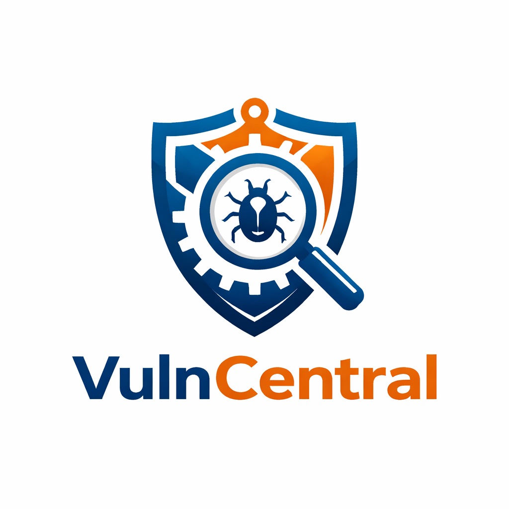
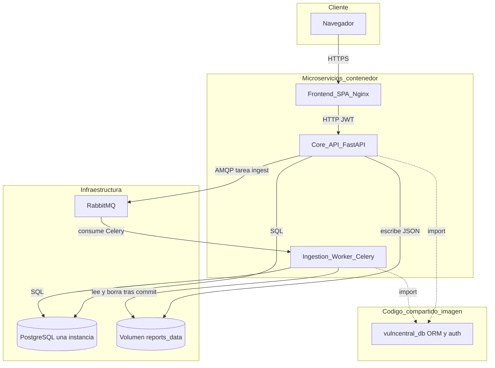
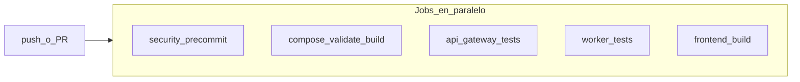
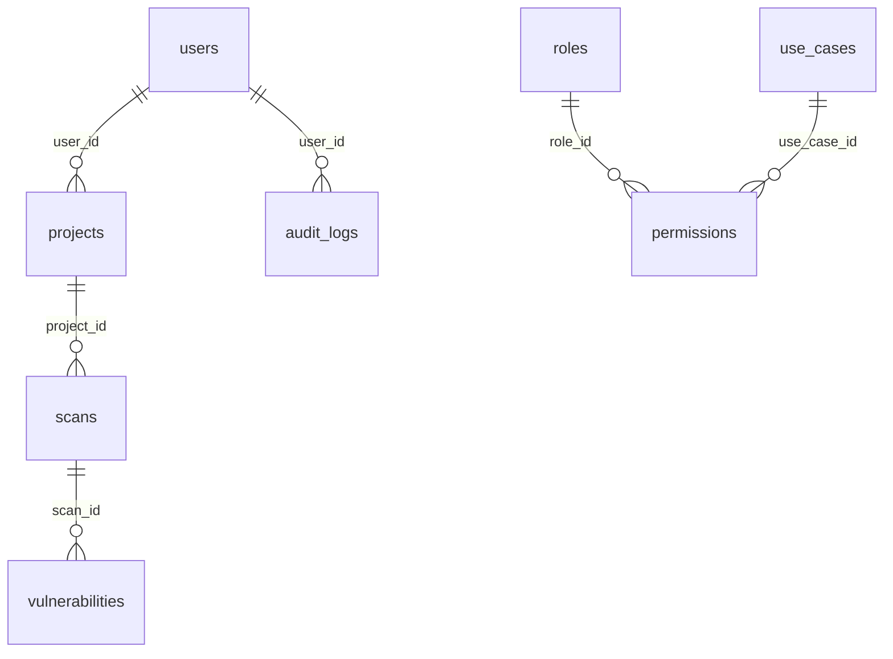

# VulnCentral




---
# Fundación Universitaria UNIMINUTO
**Especialización en Ciberseguridad**
**Materia: Seguridad Entornos Cloud DevOps**

## 👥 Autores

- Ing. Argel Ochoa Ronald David  
- Ing. Baquero Soto Mauricio  
- Ing. Buitrago Guiot Oscar Javier  
- Ing. Estefania Naranjo Novoa  

---

## Descripción del aplicativo 

### Nombre
VulnCentral: Plataforma DevSecOps para la Centralización y Gestión de Vulnerabilidades

### Descripción
VulnCentral es una aplicación diseñada para centralizar, normalizar y gestionar hallazgos de vulnerabilidades provenientes de múltiples herramientas de seguridad (SAST, DAST, SCA y escaneo de contenedores). La solución permite a los equipos de seguridad visualizar, priorizar y dar seguimiento a vulnerabilidades desde una única plataforma.

### Justificación
En entornos DevSecOps modernos, las herramientas de seguridad generan reportes aislados, dificultando su análisis y gestión. VulnCentral resuelve este problema proporcionando una capa de agregación y gestión centralizada.

### Objetivo
Construir un sistema DevSecOps funcional con:
- API Gateway
- Worker asíncrono
- Pipeline CI/CD
- Seguridad integrada


# [GUIA DE INICIO RAPIDO](docs/Inicio_Rapido.md)


# DESCRIPCIÓN TÉCNICA DESARROLLO

## 🏗️ Plataforma base (Fase 1) 
**Estructura de repositorio, Docker Compose, servicios mínimos sin lógica de negocio.**

### Requisitos


| Herramienta                           | Comprobación                                 |
| ------------------------------------- | -------------------------------------------- |
| Docker Engine + Compose v2            | `docker --version`, `docker compose version` |
| Python 3.12 (tests locales del API)   | `python --version`                           |
| Node.js 20 (build local del frontend) | `node --version`                             |


### Inicio rápido

1. Copiar variables de entorno:
  ```bash
   cp .env.example .env
  ```
   Edita `.env` y cambia contraseñas y secretos.
2. Levantar el stack en desarrollo:
  ```bash
   docker compose up --build
  ```
3. Comprobar servicios:
  - Frontend: [http://localhost:8080](http://localhost:8080) (mapeo `${FRONTEND_PORT:-8080}:8080`: el **host** usa `FRONTEND_PORT` y el contenedor sirve Nginx en **8080** como usuario no root; ver PASO 3)
  - API: [http://localhost:8000/health](http://localhost:8000/health) (puerto por defecto `API_GATEWAY_PORT`)
  - RabbitMQ Management: [http://localhost:15672](http://localhost:15672) (usuario/clave según `.env`)
  - pgAdmin: [http://localhost:5050](http://localhost:5050) (puerto `PGADMIN_PORT`; email/clave `PGADMIN_DEFAULT_*` en `.env`). Al registrar el servidor usa host `**postgres**`, puerto **5432**, usuario y contraseña de PostgreSQL del `.env`.

**Docker Compose en PowerShell:** si ves líneas en rojo con `NativeCommandError` y texto `Built`, suele ser **stderr** de Docker (no implica fallo). Comprueba con `docker compose ps` que los servicios estén `running` / `healthy`. Si el error es **bind: address already in use** al publicar el frontend, otro proceso usa ese puerto: deja `FRONTEND_PORT=8080` en `.env` (valor por defecto en compose) o libera el puerto.

Tras cambiar `FRONTEND_PORT` o `CORS_ORIGINS` en `.env`, recrea los servicios afectados: `docker compose up -d --force-recreate frontend api-gateway` (así el mapeo de puertos y CORS se aplican sin contenedores antiguos).

## Producción (override)

Reduce exposición de puertos y ajusta límites:

```bash
docker compose -f docker-compose.yml -f docker-compose.prod.yml --env-file .env up -d --build
```

En el override, el frontend suele publicarse en el host en el puerto **8080** (`8080:8080`; el contenedor escucha **8080** como usuario no root). PostgreSQL y RabbitMQ dejan de exponer puertos al host; usa red interna o túnel según tu despliegue. **pgAdmin** queda asignado al perfil `dev-tools` y no arranca salvo que ejecutes `docker compose ... --profile dev-tools up`.

## Volúmenes

- **Informes compartidos**: volumen Docker `reports_data` montado en `**/app/data/reports`** en `api-gateway` y `worker`.
- **Datos de PostgreSQL y RabbitMQ**: volúmenes nombrados `postgres_data` y `rabbitmq_data`.

## Límites de memoria (`deploy.resources.limits.memory`)

El `docker-compose.yml` define `deploy.resources.limits.memory` por servicio, como pide la especificación. Con `docker compose up` (sin Swarm), **algunas versiones ignoran la sección `deploy`**; para aplicar límites de forma efectiva puedes usar **Docker Swarm** (`docker stack deploy -c orchestration/docker-swarm/stack.yml vulncentral`, tras construir y publicar imágenes) o definir alternativas compatibles con tu entorno.

## Estructura del repositorio

```text
vulncentral/
├── packages/
│   └── vulncentral-db/  # Modelos ORM + auth bcrypt compartidos (API + worker, una sola PostgreSQL)
├── services/
│   ├── frontend/      # React (Vite) + nginx
│   ├── api-gateway/   # FastAPI (Core API)
│   └── worker/        # Celery (Ingestion worker)
├── scripts/           # p. ej. smoke-compose.sh
├── orchestration/     # Docker Swarm, Kubernetes
├── infrastructure/    # Terraform, Ansible
├── monitoring/        # Prometheus, Grafana, Loki (referencia)
├── docs/
└── .github/workflows/
```

## Arquitectura (microservicios y PostgreSQL compartida)

Vista de los **servicios desplegables** (contenedores), el **paquete compartido** `vulncentral_db` (mismo código ORM en API y worker, no es un proceso en ejecución) y la **infraestructura** común. Detalle en [docs/architecture-shared-db-microservices.md](docs/architecture-shared-db-microservices.md).



**Flujo de ingesta Trivy:** el Core API valida el JSON, lo guarda en el volumen y publica en RabbitMQ la tarea `vulncentral.ingest_trivy_json` con `scan_id`, ruta absoluta y `correlation_id`. El worker procesa y persiste en la misma base; luego elimina el fichero si el commit fue correcto.

## Celery

<span style="color:blue">
  **Celery es una de las herramientas más potentes y utilizadas en el ecosistema de Python para manejar colas de tareas asíncronas y programación de trabajos en tiempo real.**
</span>.

- **Broker**: RabbitMQ (`CELERY_BROKER_URL`).
- **Resultados (desarrollo)**: `CELERY_RESULT_BACKEND=rpc://` (mismo broker). Para producción avanzada se puede migrar a Redis o base de datos en fases posteriores.

## Kubernetes (esqueleto)

Manifiestos de ejemplo en `[orchestration/k8s/](orchestration/k8s/)`. Ajusta `[secrets.yaml](orchestration/k8s/secrets.yaml)` y construye las imágenes `vulncentral/api-gateway`, `vulncentral/worker` y `vulncentral/frontend` antes de aplicar.

Hosts de ejemplo en Ingress: `api.vulncentral.local`, `app.vulncentral.local`.

## Verificación local (sin Docker)

```bash
# API Gateway (instala `vulncentral_db` editable desde packages/)
cd services/api-gateway
pip install -r requirements-dev.txt
pytest -q

# Worker
cd services/worker
pip install -r requirements.txt -r requirements-dev.txt
pytest -q

# Frontend
cd services/frontend
npm ci
npm run build
```

## Validar Compose

```bash
docker compose --env-file .env.example config
docker compose -f docker-compose.yml -f docker-compose.prod.yml --env-file .env.example config
```

## PASO 1 — DevSecOps (seguridad desde el desarrollador)

**Objetivo:** impedir que secretos, patrones inseguros o dependencias vulnerables entren al repositorio mediante controles locales (`pre-commit`) y la misma batería en **GitHub Actions** (job `security`), alineado con [.cursor/prompts/Ajustes_Finales_Fase_1.md](.cursor/prompts/Ajustes_Finales_Fase_1.md).

### Herramientas implementadas

| Herramienta | Rol |
| --- | --- |
| [Gitleaks](https://github.com/gitleaks/gitleaks) | Detección de secretos en el árbol versionado |
| [Semgrep](https://semgrep.dev/) | SAST con reglas `p/python` y `p/ci`; falla con severidad **ERROR** (equivalente operativo a HIGH/CRITICAL del prompt) |
| [Bandit](https://github.com/PyCQA/bandit) | SAST Python; solo hallazgos de severidad **alta** (`-lll`) provocan fallo |
| [pip-audit](https://pypi.org/project/pip-audit/) | SCA sobre `services/api-gateway/requirements.txt` y `services/worker/requirements.txt`; **cualquier CVE conocida** hace fallar el hook (no hay equivalente estable a “solo CRITICAL” como en npm; ver PASO 2) |
| `npm audit` | SCA frontend con `--audit-level=critical` en `services/frontend` (fallo solo en **CRITICAL**; HIGH opcional según política del prompt) |

Configuración: [`.pre-commit-config.yaml`](.pre-commit-config.yaml), exclusiones Semgrep en [`.semgrepignore`](.semgrepignore).

### Pasos ejecutados (resumen)

1. Añadir [`.pre-commit-config.yaml`](.pre-commit-config.yaml) con los hooks anteriores.
2. Añadir job `security` en [`.github/workflows/ci.yml`](.github/workflows/ci.yml) que ejecuta `pre-commit run --all-files` (misma política que en local).
3. Documentar secretos de GitHub y criterios de fallo en este README.

### Comandos utilizados

```bash
# Instalar y activar hooks (una vez por clon)
python -m pip install "pre-commit>=3.5"
pre-commit install

# Ejecutar toda la batería (equivalente a CI)
# En Windows PowerShell, si Semgrep falla por codificación, usar UTF-8:
$env:PYTHONUTF8 = "1"; $env:PYTHONIOENCODING = "utf-8"; pre-commit run --all-files
```

En Linux/macOS suele bastar `pre-commit run --all-files` (locale UTF-8 por defecto).

### Evidencias esperadas

- `pre-commit run --all-files` termina con código **0** cuando no hay hallazgos que violen la política.
- Gitleaks **rechaza** un commit de prueba si se introduce un patrón tipo clave API en un archivo trackeado (puedes revertir al instante).
- En GitHub, el job **`security`** aparece en verde en PRs/push a `main`/`master`.

### Gestión de secretos (GitHub)

| Nombre | Uso | Obligatorio crear en el repo |
| --- | --- | --- |
| `GITHUB_TOKEN` | Proporcionado automáticamente en Actions | No |
| `API_KEYS` / otros | Solo si un workflow llama APIs externas o despliegues que lo requieran; referencia en YAML con `${{ secrets.NOMBRE }}` | Solo si aplica |

Nunca subas valores reales: usa **GitHub → Settings → Secrets and variables → Actions** y documenta aquí solo los **nombres** y el propósito.

### Problemas comunes y soluciones

| Síntoma | Causa probable | Qué hacer |
| --- | --- | --- |
| Semgrep: `UnicodeEncodeError` / `charmap` en Windows | Consola o Python en cp1252 al resolver reglas remotas | Exportar `PYTHONUTF8=1` y `PYTHONIOENCODING=utf-8` antes de `pre-commit` (el job `security` en CI ya las define). |
| `npm audit` sin `node` en PATH | Ejecutar hook fuera de entorno con Node | Instala Node 20 o usa el mismo comando tras `setup-node` como en CI. |
| Gitleaks falla en archivos de ejemplo | Patrones que parecen secretos | Ajusta [`.gitleaksignore`](.gitleaksignore) si el equipo acota exclusiones documentadas. |
| Semgrep/Bandit demasiado ruidosos | Reglas o código de prueba | Afinar `.semgrepignore`, exclusiones Bandit o reglas en un `semgrep` dedicado (sin relajar sin consenso). |

`.env` debe permanecer fuera de Git: ya está listado en [`.gitignore`](.gitignore).

## PASO 2 — DevSecOps (CI/CD con seguridad)

**Nota de nomenclatura:** esto es el **PASO 2** del plan DevSecOps (pipeline y políticas en CI). No confundir con la sección **Plataforma base (Fase 2)** más abajo en este README (base de datos y Alembic): es otro hilo del proyecto.

**Objetivo:** que cada **push** y **pull request** a `main`/`master` ejecute **build** del proyecto y controles **SAST/SCA** en GitHub Actions, con reglas de fallo documentadas, según [.cursor/prompts/Ajustes_Finales_Fase_2.md](.cursor/prompts/Ajustes_Finales_Fase_2.md).

### Arquitectura del pipeline CI/CD

Los jobs del workflow [`.github/workflows/ci.yml`](.github/workflows/ci.yml) se disparan en paralelo (salvo que en el futuro se encadenen con `needs:`). El **build** y la **seguridad** no duplican SAST/SCA en YAML aparte: el job `security` ejecuta la misma batería que en local vía `pre-commit` (definida en [PASO 1](#paso-1--devsecops-seguridad-desde-el-desarrollador)).



### Herramientas en CI (SAST y SCA) y justificación breve

| Capa | Herramienta | Por qué en CI |
| --- | --- | --- |
| SAST multi-lenguaje | Semgrep | Reglas públicas `p/python` y `p/ci`; umbral de fallo alineado con severidad **ERROR** en hook |
| SAST Python | Bandit | Análisis estático centrado en patrones de riesgo en `services/api-gateway` y `services/worker` |
| SCA Python | pip-audit | Auditoría de dependencias declaradas frente a bases de vulnerabilidades (PyPI/OSV) |
| SCA Node | npm audit | Alineado con criterio “fallar en **CRITICAL**” (`--audit-level=critical`) |

### Build automático en CI (qué cuenta como “build”)

- **Imágenes Docker** de backend: job `compose-validate` ejecuta `docker compose ... build api-gateway worker` con [`.env.example`](.env.example).
- **Frontend producción**: job `frontend-build` ejecuta `npm ci` y `npm run build` (Vite) en `services/frontend`.
- **Tests** (calidad de build lógico): `pytest` en API gateway y worker.

### Regla de fallo por CVEs (críticos y política Python)

| Origen | Comportamiento |
| --- | --- |
| **npm** (`services/frontend`) | El pipeline falla si `npm audit` reporta vulnerabilidades **CRITICAL** (`--audit-level=critical`). |
| **pip-audit** (Python) | La versión usada en [`.pre-commit-config.yaml`](.pre-commit-config.yaml) **no expone** un filtro “solo severidad CRITICAL”. Si encuentra **cualquier** CVE conocida para una dependencia resuelta, el proceso termina con **código distinto de cero** (política más estricta que la del frontend). Mitigar con versiones corregidas o, como último recurso, `--ignore-vuln` documentado en el equipo. |

### Pasos ejecutados (resumen)

1. Reutilizar el job `security` y [`.pre-commit-config.yaml`](.pre-commit-config.yaml) definidos en PASO 1 (sin duplicar Semgrep/Bandit/pip-audit/npm en pasos sueltos del YAML salvo requisito académico explícito).
2. Mantener jobs de build y tests ya existentes en [`.github/workflows/ci.yml`](.github/workflows/ci.yml).
3. Documentar esta sección (PASO 2) y la asimetría pip-audit vs npm en el README.

### Comandos útiles (validación local acorde a CI)

```bash
# Equivale a la parte “DevSecOps” del job security en Actions
$env:PYTHONUTF8 = "1"; $env:PYTHONIOENCODING = "utf-8"; pre-commit run --all-files   # PowerShell
# docker compose build (como en CI)
docker compose --env-file .env.example build api-gateway worker
```

### Evidencias esperadas en CI

- En la pestaña **Actions** del repositorio: workflow **CI** en verde para el commit.
- Logs del job **`security`**: líneas de cada hook de `pre-commit` (Gitleaks, Semgrep, Bandit, pip-audit, npm audit) sin fallo.
- Logs de **`compose-validate`** / **`frontend-build`**: build completado sin error.

### Cómo comprobar fallo ante vulnerabilidad crítica (frontend)

Introducir una dependencia vulnerable de prueba en `services/frontend` (rama temporal), ejecutar CI o `npm audit --audit-level=critical --prefix services/frontend` y comprobar **exit code ≠ 0**; revertir el cambio después.

### GitHub Secrets en esta fase

Para SAST/SCA y builds actuales **no se requieren** secretos adicionales: el contenido del repo y `GITHUB_TOKEN` bastan. Añade secretos solo si añades pasos de despliegue o APIs externas (referencia con `${{ secrets.NOMBRE }}` sin imprimir valores en logs).

### Fail-fast y jobs paralelos

Cada job falla por sí mismo si un paso devuelve error. GitHub **no cancela** automáticamente el resto de jobs en paralelo cuando uno falla (comportamiento distinto a `fail-fast` de una matriz). La “detención” efectiva es: el workflow se marca como **fallido** y el PR no debería fusionarse.

### Problemas comunes (PASO 2)

| Síntoma | Qué revisar |
| --- | --- |
| `security` verde pero vulnerabilidad conocida en Python | pip-audit puede no estar resolviendo el mismo subconjunto que tu entorno local; revisa `requirements.txt` y versiones pinadas. |
| `security` rojo por pip-audit, no por npm | Es esperable: la política Python es **cualquier CVE** reportada por la herramienta, no solo CRITICAL. |
| Builds Docker fallan en CI | Credenciales no deben ir en Dockerfile; revisa contexto de build y [`.env.example`](.env.example). |

## PASO 3 — DevSecOps (contenedores seguros)

**Nota de nomenclatura:** es el **PASO 3** del plan DevSecOps (Dockerfiles endurecidos + **Trivy** en CI). No confundir con otras secciones tituladas “Fase …” del README (p. ej. base de datos). Especificación: [.cursor/prompts/Ajustes_Finales_Fase_3.md](.cursor/prompts/Ajustes_Finales_Fase_3.md).

### Objetivo

Imágenes **construidas en el repositorio** (`api-gateway`, `worker`, `frontend`) con buenas prácticas (multi-stage donde aplica, **sin `latest`**, usuario **no root** en runtime), **actualización de paquetes del SO** en build (`apt-get upgrade` en Debian, `apk upgrade` en Alpine) y **escaneo Trivy** en GitHub Actions: se consideran **HIGH/CRITICAL** con **`ignore-unfixed: true`** (el job falla si hay hallazgos **con parche disponible** que la imagen aún no incorpora; se omiten CVE sin fix en el distro, p. ej. `will_not_fix`).

### Alcance del escaneo Trivy

- **Incluido en CI:** solo las tres imágenes construidas desde los Dockerfiles del monorepo (tags `vulncentral-ci:*` en el job `trivy-images`).
- **Fuera de alcance por defecto:** imágenes de terceros referenciadas en Compose (PostgreSQL, RabbitMQ, pgAdmin, etc.). Escanearlas implicaría otra política y más tiempo de job.

### Herramientas implementadas

| Herramienta | Rol |
| --- | --- |
| [Trivy](https://github.com/aquasecurity/trivy) | Escaneo de vulnerabilidades en imágenes OCI construidas en CI |
| Dockerfiles multi-stage | `services/api-gateway/Dockerfile`, `services/worker/Dockerfile`: venv en etapa `builder`, copia a imagen final |
| Nginx no root | `services/frontend/Dockerfile` + [services/frontend/nginx.main.conf](services/frontend/nginx.main.conf): escucha **8080**, `USER nginx` |
| [.trivyignore](.trivyignore) | Plantilla para exclusiones documentadas (CVE sin fix, falsos positivos) |

### Pasos ejecutados (resumen)

1. Endurecer Dockerfiles (multi-stage Python; frontend con Nginx en 8080 y usuario `nginx`).
2. Ajustar mapeos de puertos en [docker-compose.yml](docker-compose.yml), [docker-compose.prod.yml](docker-compose.prod.yml) y manifiestos K8s del frontend ([orchestration/k8s/deployments/frontend.yaml](orchestration/k8s/deployments/frontend.yaml), [orchestration/k8s/services/frontend.yaml](orchestration/k8s/services/frontend.yaml)).
3. Añadir job `trivy-images` en [.github/workflows/ci.yml](.github/workflows/ci.yml) con [aquasecurity/trivy-action](https://github.com/aquasecurity/trivy-action) (`severity: CRITICAL,HIGH`, `exit-code: 1`, `ignore-unfixed: true`).

### Comandos utilizados (local)

```bash
# Build alineado con CI (contextos como en el workflow)
docker build -t vulncentral-ci:api-gateway -f services/api-gateway/Dockerfile .
docker build -t vulncentral-ci:worker -f services/worker/Dockerfile .
docker build -t vulncentral-ci:frontend --build-arg VITE_API_BASE_URL=http://localhost:8000 -f services/frontend/Dockerfile services/frontend

# Trivy local (requiere binario o contenedor aquasec/trivy)
docker run --rm -v /var/run/docker.sock:/var/run/docker.sock aquasec/trivy:latest image --severity HIGH,CRITICAL --ignore-unfixed --exit-code 1 vulncentral-ci:api-gateway
```

En Windows con Docker Desktop, el socket puede variar; en CI el job usa el entorno estándar de GitHub.

### Evidencias esperadas

- En **Actions**, el job **`trivy-images`** en verde: tres pasos Trivy sin hallazgos HIGH/CRITICAL **con fix pendiente de aplicar** (según `ignore-unfixed`).
- `docker compose up` con frontend **healthy** en `http://localhost:${FRONTEND_PORT:-8080}` (health interno en `:8080` del contenedor).

### Problemas comunes y soluciones

| Síntoma | Qué hacer |
| --- | --- |
| Trivy falla por CVE en imagen base sin parche | Actualizar tag de base (`python:3.12-slim-bookworm`, `nginx:1.27-alpine`, etc.) o documentar excepción puntual en `.trivyignore` con justificación. |
| Frontend no arranca tras el cambio | Comprobar mapeo `HOST:8080` y que ningún proxy asuma puerto 80 **dentro** del contenedor. |
| Confusión Trivy “ingesta JSON” vs “scan CI” | La **ingesta** de informes Trivy en la app es otro flujo (API/worker). El **scan** de PASO 3 solo valida imágenes en build. |

## Integración continua (GitHub Actions)

El workflow [`.github/workflows/ci.yml`](.github/workflows/ci.yml) ejecuta **integración continua** en cada **push** y en cada **pull request** hacia las ramas `main` o `master`. Si algún job falla, el workflow falla (en PRs el check aparece como no superado).

### Jobs (se ejecutan en paralelo)

| Job | Objetivo |
| --- | --- |
| `security` | Misma batería que `pre-commit` (Gitleaks, Semgrep, Bandit, pip-audit, npm audit) vía `pre-commit run --all-files` |
| `compose-validate` | Validar Docker Compose y construir imágenes de `api-gateway` y `worker` |
| `trivy-images` | Construir las tres imágenes propias y escanearlas con Trivy (**CRITICAL** y **HIGH**, `ignore-unfixed`) |
| `api-gateway-tests` | Tests de Python del servicio API Gateway (`pytest`) |
| `worker-tests` | Tests de Python del worker Celery (`pytest`) |
| `frontend-build` | Instalación con `npm ci` y build de producción con Vite |

### Qué hace cada job

- **`security`**: Ubuntu, Python **3.12**, Node **20** (caché npm del frontend), instala `pre-commit` y ejecuta `pre-commit run --all-files` con `PYTHONUTF8=1` y `PYTHONIOENCODING=utf-8` (misma política que en máquinas locales con UTF-8).
- **`compose-validate`** (Ubuntu, Docker Compose): clona el repo; valida la sintaxis con `docker compose --env-file .env.example config`; valida la fusión dev + prod con `docker compose -f docker-compose.yml -f docker-compose.prod.yml --env-file .env.example config`; construye las imágenes `api-gateway` y `worker` con `docker compose ... build api-gateway worker` (contexto en la raíz del repositorio).
- **`trivy-images`**: construye `vulncentral-ci:api-gateway`, `vulncentral-ci:worker` y `vulncentral-ci:frontend` con los mismos `docker build` que en el README (PASO 3) y ejecuta **Trivy** (`aquasecurity/trivy-action@v0.35.0`) con `severity: CRITICAL,HIGH`, `exit-code: 1` e `ignore-unfixed: true` por imagen.
- **`api-gateway-tests`**: directorio `services/api-gateway`, Python **3.12**, `pip install -r requirements-dev.txt`, luego `pytest -q`.
- **`worker-tests`**: directorio `services/worker`, Python **3.12**, `pip install -r requirements.txt -r requirements-dev.txt`, luego `pytest -q`.
- **`frontend-build`**: directorio `services/frontend`, Node **20** (caché de npm con `package-lock.json`), `npm ci` y `npm run build` con `VITE_API_BASE_URL=http://localhost:8000` para el entorno de CI.

---

## 🗄️ Plataforma base (Fase 2)
**Base de datos, modelos y Alembic**

---

name: Fase 2 BD y Alembic
overview: Añadir SQLAlchemy 2.x, modelos según el diccionario de datos, hashing de contraseñas, Alembic en `services/api-gateway` y una migración inicial que cree todas las tablas con FKs y soft delete donde corresponde.
todos:

- id: deps-db
content: Añadir sqlalchemy, psycopg, alembic, passlib[bcrypt] a requirements.txt y fijar versiones razonables
status: completed
- id: core-db
content: Crear app/db (Base, session, get_database_url) y app/security/password.py
status: completed
- id: models
content: Implementar modelos SQLAlchemy 2.x + relaciones FK + soft delete + validates
status: completed
- id: alembic
content: Inicializar Alembic (ini + env.py) apuntando a Base.metadata
status: completed
- id: migration
content: Generar revisión inicial con todas las tablas, FKs, índices y unique email
status: completed
- id: docker-env
content: Actualizar Dockerfile (copiar alembic), .env.example (POSTGRES_HOST / DATABASE_URL)
status: completed
- id: tests
content: Ajustar/añadir test mínimo compatible con CI
status: completed
isProject: false

---

## Contexto

**FastAPI es un framework web moderno, de alto rendimiento, para construir APIs con Python basado en las anotaciones de tipo estándar de Python (Python type hints)**

- La app vive en `[services/api-gateway](services/api-gateway)`: FastAPI sin ORM hoy (`[app/main.py](services/api-gateway/app/main.py)`).
- Postgres 16 ya está definido en `[docker-compose.yml](docker-compose.yml)`; el gateway recibe `POSTGRES_*` pero no hay `DATABASE_URL` ni modelos.
- CI ejecuta `pytest` en `services/api-gateway` con `[requirements-dev.txt](services/api-gateway/requirements-dev.txt)`.

## Decisiones alineadas con el diccionario


| Tema                      | Enfoque                                                                                                                                                                                                                                                                                            |
| ------------------------- | -------------------------------------------------------------------------------------------------------------------------------------------------------------------------------------------------------------------------------------------------------------------------------------------------- |
| Ubicación                 | Todo en `services/api-gateway` (sin paquete compartido salvo que más adelante el worker necesite los mismos modelos).                                                                                                                                                                              |
| Motor SQL                 | PostgreSQL en producción; `DATABASE_URL` con fallback armado desde `POSTGRES_USER`, `POSTGRES_PASSWORD`, `POSTGRES_HOST` (nuevo en `[.env.example](.env.example)`), `POSTGRES_PORT`, `POSTGRES_DB` — coherente con variables ya usadas en compose.                                                 |
| Tipos BIGINT / timestamps | `BigInteger` + `identity` (auto-incremento), `DateTime(timezone=True)` con `server_default=func.now()` para `created_at`/`updated_at`/`timestamp` en audit; `onupdate` en `updated_at` donde aplique.                                                                                              |
| Soft delete               | `deleted_at` nullable en todas las tablas del diccionario que lo incluyen; **no** en `audit_logs` (no figura en el spec).                                                                                                                                                                          |
| `permissions` C/R/U/D     | Columnas SQL nombradas `c`, `r`, `u`, `d` tipo `BOOLEAN` NOT NULL default `false` (corrige el typo “bolean” del prompt); atributos Python legibles vía `mapped_column("c", ...)` etc.                                                                                                              |
| Contraseñas               | La columna sigue llamándose `password` (VARCHAR 255); solo se almacenan **hashes** (p. ej. bcrypt vía `passlib[bcrypt]`). Helpers en algo como `app/security/password.py` (`hash_password`, `verify_password`).                                                                                    |
| Validaciones              | En capa modelo: `sqlalchemy.orm.validates` para email (formato básico), longitudes máximas coherentes con VARCHAR del diccionario, y campos obligatorios donde el negocio lo exija; restricciones `CheckConstraint` opcionales (p. ej. `line_number >= 0` si se desea rigor sin salirse del spec). |


## Relaciones (solo FKs explícitas en el diccionario)



**Nota:** El diccionario no define `user_id` en `roles` ni tabla puente usuario–rol; no se añadirán tablas o FKs no listadas.

## Estructura de archivos propuesta

- `[services/api-gateway/app/db/base.py](services/api-gateway/app/db/base.py)` — `DeclarativeBase`.
- `[services/api-gateway/app/db/session.py](services/api-gateway/app/db/session.py)` — `engine`, `SessionLocal`, función `get_database_url()`.
- `[services/api-gateway/app/models/__init__.py](services/api-gateway/app/models/__init__.py)` — exportar modelos y `Base.metadata` para Alembic.
- Un módulo por entidad (o un solo `models.py` si prefieres menos archivos; el plan recomienda paquete `models/` con `user.py`, `project.py`, …) con relaciones `relationship()` y `back_populates` donde aporte claridad.
- `[services/api-gateway/app/security/password.py](services/api-gateway/app/security/password.py)` — hashing/verificación.

## Dependencias

Actualizar `[services/api-gateway/requirements.txt](services/api-gateway/requirements.txt)`: `sqlalchemy`, `psycopg[binary]` (o equivalente estable para PG), `alembic`, `passlib[bcrypt]`.

## Alembic

- Inicializar en `services/api-gateway/`: `alembic.ini` con `script_location = alembic`, versión de logs en `alembic/versions/`.
- `[alembic/env.py](services/api-gateway/alembic/env.py)`: importar `Base` y **todos** los modelos para registrar metadata; `target_metadata = Base.metadata`; `run_migrations_offline/online` con la misma URL que la app.
- **No** enlazar aún el motor en `create_app()` (Fase 1 sigue siendo API mínima) salvo que se quiera un healthcheck de DB; el entregable del prompt son modelos + Alembic + migración, no endpoints CRUD.

## Migración inicial

- Un solo revision id tipo `xxxx_initial_schema`: `op.create_table` para `users`, `projects`, `scans`, `vulnerabilities`, `audit_logs`, `use_cases`, `roles`, `permissions` con tipos y `ForeignKey(..., ondelete="RESTRICT"|"CASCADE"` según criterio conservador: típicamente `RESTRICT` en FKs salvo que se quiera borrado en cascada explícito; documentar en comentario de migración).
- Índices explícitos en columnas FK (Postgres no indexa automáticamente el lado “hijo” de todas las FK).
- `UNIQUE` en `users.email` tal como indica el diccionario.

## Docker / entorno

- Ajustar `[services/api-gateway/Dockerfile](services/api-gateway/Dockerfile)`: copiar `alembic/` y `alembic.ini` además de `app/`.
- Añadir en `[.env.example](.env.example)`: `POSTGRES_HOST=localhost` (para Alembic desde máquina host) y opcionalmente `DATABASE_URL=` comentado.

## Pruebas

- Test ligero que importe metadata y verifique nombres de tablas/columnas clave, o `metadata.create_all` sobre SQLite en memoria **solo** si no hay tipos incompatibles (PG `JSONB`/específicos pueden romper); si hay fricción, test mínimo de importación de modelos y que `User.password` no sea texto plano en un flujo de `set_password` helper.

## Comando operativo (post-implementación)

Desde `services/api-gateway` con Postgres accesible: `alembic upgrade head`.

---

## 👥 Autenticación JWT y RBAC (api-gateway) (Fase 3) 


**JWT y OAuth 2.0 suelen trabajar juntos, pero la diferencia principal es que JWT es un formato de datos (un token), mientras que OAuth 2.0 es un protocolo (un marco de trabajo), para entenderlo de forma sencilla: OAuth 2.0 es el proceso que sigues para obtener una llave, y JWT es el material y el diseño de la llave misma.**

Pasos realizados en esta fase:

- Migración Alembic `8a2b3c4d5002`: columna `users.role_id` (FK a `roles`, nullable hasta poblar datos).
- Login con OAuth2 password (`username` = email), emisión de JWT HS256, cabecera `Authorization: Bearer` en rutas protegidas.
- Middleware que exige JWT válido y no expirado para `/api/`* y `GET /auth/me`; rutas públicas incluyen `/health`, `/`, documentación OpenAPI y `POST /auth/login`.
- RBAC con `Depends`: permisos por caso de uso (`Gestor usuarios`, `Gestor proyectos`, etc.) y acciones c/r/u/d según tabla `permissions`.
- Script de seed en Python (orden: `use_cases` → `roles` → `permissions` → usuario inicial).

### Variables de entorno (además de las ya descritas)

En `.env` / `.env.example`: `JWT_SECRET` (obligatorio para login), `JWT_ALGORITHM` (por defecto `HS256`), `JWT_EXPIRE_MINUTES` (opcional; por defecto 30 en código si no se define).

# Comandos que debe ejecutar el usuario (PostgreSQL + API)

***Para actualizar a FASE 4***
Desde la raíz del repo o con BD accesible según tu `.env`:

```bash
docker compose build api-gateway          # o --no-cache si hace falta
docker compose up -d api-gateway
docker compose exec api-gateway alembic upgrade head
docker compose exec api-gateway python -m app.scripts.seed   # si aplica (primera vez / datos)

```

Con Docker Compose, entra al contenedor del api-gateway o ejecuta los mismos comandos donde `DATABASE_URL` / `POSTGRES_*` apunten a la instancia correcta. **Tras el primer despliegue** conviene correr `alembic upgrade head` y el seed al menos una vez.

### Lista de endpoints del Core API (`services/api-gateway`)

Documentación interactiva: **`/docs`** (Swagger) y **`/redoc`**. Las rutas bajo `/api` y `GET /auth/me` exigen cabecera `Authorization: Bearer <access_token>`. El CRUD y `gestores/*` aplican **RBAC** según permisos del rol.

**Sin JWT**

| Método | Ruta | Descripción |
| ------ | ---- | ----------- |
| `GET` | `/` | Identificación del servicio |
| `GET` | `/health` | Comprobación de salud |
| `POST` | `/auth/login` | Login (`username` email, `password`; formulario URL-encoded) |

**Con JWT**

| Método | Ruta |
| ------ | ---- |
| `GET` | `/auth/me` |
| `GET` | `/api/v1/users` |
| `POST` | `/api/v1/users` |
| `GET` | `/api/v1/users/{user_id}` |
| `PATCH` | `/api/v1/users/{user_id}` |
| `DELETE` | `/api/v1/users/{user_id}` |
| `GET` | `/api/v1/projects` |
| `POST` | `/api/v1/projects` |
| `GET` | `/api/v1/projects/{project_id}` |
| `PATCH` | `/api/v1/projects/{project_id}` |
| `DELETE` | `/api/v1/projects/{project_id}` |
| `GET` | `/api/v1/scans` |
| `POST` | `/api/v1/scans` |
| `GET` | `/api/v1/scans/{scan_id}` |
| `PATCH` | `/api/v1/scans/{scan_id}` |
| `DELETE` | `/api/v1/scans/{scan_id}` |
| `POST` | `/api/v1/scans/{scan_id}/trivy-report` |
| `GET` | `/api/v1/vulnerabilities` |
| `POST` | `/api/v1/vulnerabilities` |
| `GET` | `/api/v1/vulnerabilities/{vuln_id}` |
| `PATCH` | `/api/v1/vulnerabilities/{vuln_id}` |
| `DELETE` | `/api/v1/vulnerabilities/{vuln_id}` |
| `GET` | `/api/v1/gestores/usuarios` |
| `GET` | `/api/v1/gestores/proyectos` |
| `GET` | `/api/v1/gestores/escaneos` |
| `GET` | `/api/v1/gestores/vulnerabilidades` |
| `GET` | `/api/v1/gestores/logs` |
| `GET` | `/api/v1/audit-logs` |

`GET /auth/me` incluye **`permissions`**: lista de `{ use_case, c, r, u, d }` por cada caso de uso del seed (para UIs que oculten acciones según RBAC).

`POST .../trivy-report` responde **202 Accepted** y encola el procesamiento en el worker (no envía el JSON por RabbitMQ).

`GET /api/v1/audit-logs?skip=&limit=` — listado paginado de `audit_logs` (permiso **Gestor logs** `r`).

### Ejemplo con curl (login)

```bash
curl -s -X POST "http://localhost:8000/auth/login" \
  -H "Content-Type: application/x-www-form-urlencoded" \
  -d "username=elmero%40admon.com&password=elmero%2F%2A-"
```

Respuesta incluye `access_token` y `expires_in`. Para llamar a la API protegida:

```bash
export TOKEN="<access_token>"
curl -s "http://localhost:8000/auth/me" -H "Authorization: Bearer $TOKEN"
```

### ⚠️ Usuario inicial del seed (ATENCION AQUI SE EXPONE UN SECRETO)

- Email: `elmero@admon.com`
- Contraseña (según especificación de la fase): `elmero/*-`
- Rol: Administrator

**Importante:** cambia esta contraseña y rota `JWT_SECRET` en cualquier entorno expuesto o de producción.

---

## 🔵 API Gateway: CRUD (Fase 4) 

**`/api/v1`, validaciones Pydantic, Trivy y límites**

**Pydantic es la librería de validación de datos y gestión de configuraciones más popular para Python moderno. Su función principal es asegurar que los datos con los que trabaja tu programa tengan el formato y el tipo correctos, si FastAPI es el motor de tu API, Pydantic es el filtro de seguridad que revisa cada dato que entra y sale**


Pasos realizados:

- API versionada bajo `**/api/v1`**: CRUD de **users**, **projects**, **scans** y **vulnerabilities** con soft delete (`deleted_at`), respuestas de error JSON coherentes con el resto de la app.
- **Enums** `Severity` y `VulnerabilityStatus` (`str` + `Enum`) para severidad y estado de vulnerabilidad, serializables en JSON.
- **RBAC** por caso de uso (`Gestor usuarios`, `Gestor proyectos`, etc.) con acciones `c` / `r` / `u` / `d` según la matriz del seed (p. ej. el rol Administrator **no** tiene permiso `c` sobre escaneos; para crear escaneos o proyectos suele hacer falta un rol con ese permiso, como Master).
- **Ingesta Trivy**: `POST /api/v1/scans/{scan_id}/trivy-report` acepta el mismo JSON de Trivy; el API lo guarda en volumen y encola el procesamiento (**202** + `task_id`). La persistencia en `vulnerabilities` la hace el **worker Celery** (Fase 5). Requiere permiso `**u`** sobre «Gestor escaneos».
- **Seguridad**: saneado de texto (incl. `html.escape` en descripciones y campos sensibles a XSS) antes de persistir; límite de tamaño del cuerpo para la ruta Trivy vía `**MAX_JSON_BODY_BYTES`** (por defecto 10 MiB si no se define). La comprobación usa la cabecera `**Content-Length**` cuando está presente.
- Rutas de ejemplo RBAC movidas a `**/api/v1/gestores/...**`.

### Variable de entorno adicional

- `**MAX_JSON_BODY_BYTES**`: tamaño máximo en bytes del cuerpo para `POST .../trivy-report`. Ver `[.env.example](.env.example)`.

### Ejemplos `curl` (con token)

Sustituye `$TOKEN` por el `access_token` del login.

```bash
# Listar usuarios (requiere permiso de lectura en Gestor usuarios)
curl -s "http://localhost:8000/api/v1/users" -H "Authorization: Bearer $TOKEN"

# Crear proyecto (requiere permiso `c` en Gestor proyectos; p. ej. usuario rol Master)
curl -s -X POST "http://localhost:8000/api/v1/projects" \
  -H "Authorization: Bearer $TOKEN" -H "Content-Type: application/json" \
  -d '{"user_id":1,"name":"Mi proyecto","description":null}'

# Informe Trivy mínimo (requiere permiso `u` en Gestor escaneos; ajusta scan_id)
curl -s -X POST "http://localhost:8000/api/v1/scans/1/trivy-report" \
  -H "Authorization: Bearer $TOKEN" -H "Content-Type: application/json" \
  -d '{"SchemaVersion":2,"Results":[{"Target":"image","Vulnerabilities":[{"VulnerabilityID":"CVE-2024-1","Severity":"HIGH","Title":"Test"}]}]}'
```

---

## 🔵 Worker Celery (Fase 5) 

**informe en volumen, cola y PostgreSQL**

**Pasos realizados**

- **Flujo**: el API valida el cuerpo Trivy, escribe el JSON en el volumen compartido (`reports_data` montado en `/app/data/reports` en `api-gateway` y `worker`), publica en RabbitMQ la tarea `vulncentral.ingest_trivy_json` con `scan_id`, **ruta absoluta** del fichero y `correlation_id` (trazas). El worker lee el archivo, normaliza según el mapeo de la fase (CVE, título, descripción, severidad, `file_path` desde `PkgName`/`Target`, estado `OPEN`, `line_number` 0) y hace `commit` en PostgreSQL.
- **Respuesta HTTP**: **202 Accepted** con `status: "queued"`, `task_id`, `file_path` y `correlation_id`. Para ver las vulnerabilidades creadas, usar `GET /api/v1/vulnerabilities` cuando el worker haya terminado.
- **Modelos compartidos**: el paquete [`packages/vulncentral-db`](packages/vulncentral-db) (`vulncentral_db`) es la fuente única de `Base` y tablas ORM para API y worker (PostgreSQL única). Ver [docs/architecture-shared-db-microservices.md](docs/architecture-shared-db-microservices.md), [docs/amqp-ingest-contract.md](docs/amqp-ingest-contract.md) y [docs/migrations-governance.md](docs/migrations-governance.md).
- **Docker**: el build de `api-gateway` y `worker` usa **contexto la raíz del repo** (`docker-compose.yml`) para copiar `packages/vulncentral-db`. Contenedores: `vulncentral-core-api`, `vulncentral-ingestion-worker` (el nombre del servicio en Compose sigue siendo `api-gateway` / `worker`).
- **Limpieza**: el worker **elimina el JSON** del volumen **solo tras** un `commit` correcto. Si falla validación o persistencia, el fichero permanece para diagnóstico o reintento manual (y reintentos de Celery en errores transitorios). Una limpieza periódica de huérfanos puede añadirse después si hace falta.
- **Seguridad**: comprobación de existencia del fichero y que su ruta canónica quede bajo `REPORTS_BASE_DIR` (por defecto `/app/data/reports`) para evitar path traversal.
- **Re-ingesta**: antes de insertar nuevas filas, el worker marca con soft delete (`deleted_at`) las vulnerabilidades activas previas del mismo `scan_id`, para evitar duplicados al volver a cargar un informe o en reintentos.

**Variables de entorno** (además de `CELERY_BROKER_URL` / `CELERY_RESULT_BACKEND` y `POSTGRES_*` en compose):

- `REPORTS_DIR`: carpeta donde el API escribe los JSON (por defecto `/app/data/reports`).
- `REPORTS_BASE_DIR`: carpeta base que el worker acepta al resolver rutas (por defecto `/app/data/reports`).

**Código relevante**: `services/worker/tasks/tasks.py`, `services/worker/trivy_processing.py`; productor en `services/api-gateway/app/celery_client.py`. El mapeo Trivy ↔ BD está en el worker; modelos en `vulncentral_db`.

**Humo Compose** (Linux/macOS, con Docker y `.env` listo): `bash scripts/smoke-compose.sh`

**Pruebas del worker** (desde `services/worker`):

```bash
pip install -r requirements.txt -r requirements-dev.txt
pytest -q
```

**Comandos Docker** (reconstruir API y worker tras cambios):

```bash
docker compose build api-gateway worker
docker compose up -d api-gateway worker rabbitmq postgres
```

## 🔵 API Gateway y RabbitMQ (integración con el worker) (Fase 6) 

**Pasos realizados (cierre)**

- **Objetivo**: arquitectura por microservicios donde el Core API **encola** el trabajo y el worker **consume**; el JSON del informe **no** se envía por RabbitMQ.
- **Contrato AMQP** (payload de la tarea, serialización JSON): ver [docs/amqp-ingest-contract.md](docs/amqp-ingest-contract.md). En cola solo van **`scan_id`**, **ruta absoluta** del fichero en el volumen y **`correlation_id`** opcional para trazas; el contenido Trivy queda en disco.
- **Tarea Celery**: `vulncentral.ingest_trivy_json`, cola `vulncentral`. Productor: `services/api-gateway/app/celery_client.py` (`enqueue_ingest_trivy_json`); tras validar y escribir el archivo, el endpoint `POST /api/v1/scans/{scan_id}/trivy-report` responde **202** con `task_id` y `correlation_id`.
- **Runtime**: en `.env` define **`CELERY_BROKER_URL`** (y si aplica **`CELERY_RESULT_BACKEND`**) alineados con el broker RabbitMQ del stack. El volumen Docker **`reports_data`** debe estar montado en **`/app/data/reports`** en **api-gateway** y **worker** (ya configurado en [`docker-compose.yml`](docker-compose.yml)).


## 🔵 Frontend React (Fase 7)

**(panel y consumo del Core API** 

**Pasos realizados**

- **Stack**: React 18 + Vite + **`react-router-dom`**; estado de sesión con **`AuthContext`** (token en `sessionStorage`, perfil vía `GET /auth/me` con **`permissions`**).
- **Rutas UI** (tras login): `/` panel, `/users`, `/projects`, `/scans`, `/vulnerabilities`, `/logs`, `/flow/nuevo` (asistente proyecto → escaneo → vulnerabilidades manual o JSON Trivy). Entrada pública: `/login`.
- **RBAC en UI**: enlaces del menú y botones crear/editar/eliminar/ver según `permissions` del mismo nombre de caso de uso que el API (`Gestor usuarios`, etc.).
- **Servicios**: `services/frontend/src/services/*` + `apiClient.js` (`VITE_API_BASE_URL`, Bearer en rutas protegidas; login con `application/x-www-form-urlencoded`).
- **API ampliada para el panel**: `GET /auth/me` devuelve **`permissions`**; **`GET /api/v1/audit-logs`** lista `audit_logs` con paginación (puede estar vacío si no hay filas).
- **Código**: páginas en `services/frontend/src/pages/`, layout en `components/Layout.jsx`, auth en `context/AuthContext.jsx`.

**Desarrollo local del frontend** (API en otro origen: configurar proxy o CORS ya previsto en el Core API):

```bash
cd services/frontend
npm ci
# Opcional: .env.local con VITE_API_BASE_URL=http://localhost:8000
npm run dev
```

**Build de producción**:

```bash
cd services/frontend
npm ci
npm run build
```

En Docker, el build del servicio `frontend` usa el argumento **`VITE_API_BASE_URL`** (ver [`docker-compose.yml`](docker-compose.yml)); ajusta la URL pública del API para el navegador.

## Comandos que debe ejecutar el usuario


Reconstruir y arrancar (desde la raíz del repo):

```bash
docker compose build api-gateway
docker compose up -d api-gateway
```


## 🔐 Endurecimiento de Seguridad (Fase 8)

**WASP: rate limit, auditoría, IDOR, MIME, logging**

**Controles añadidos**

- **Rate limiting** (`slowapi`): por defecto **`POST /auth/login`** limita intentos por IP (cabecera **`X-Forwarded-For`** si existe; si no, IP del cliente). Respuesta **429** con código `rate_limited`. Variables: **`RATE_LIMIT_ENABLED`** (`true` por defecto; `false`/`0`/`off` desactiva), **`RATE_LIMIT_LOGIN`** (p. ej. `5/minute`; `0`/`off`/`none` desactiva solo el límite de login, útil en tests).
- **Auditoría**: inserciones en **`audit_logs`** en login (éxito/fallo), mutaciones relevantes en usuarios/proyectos/escaneos/vulnerabilidades e ingesta Trivy. Los registros **no** incluyen contraseñas ni tokens. Migración Alembic **`9b1c2d3e4003`**: columna **`audit_logs.user_id`** pasa a ser **nullable** (eventos anónimos, p. ej. login fallido). Tras desplegar: `alembic upgrade head`.
- **IDOR / alcance por objeto**: salvo roles con alcance global (**Administrator** y **Master**), los listados y lecturas de **proyectos**, **escaneos** y **vulnerabilidades** se restringen a recursos cuyo proyecto pertenece al usuario autenticado (`projects.user_id`). Crear proyecto sin alcance global solo si **`user_id` del cuerpo** coincide con el usuario actual.
- **Content-Type JSON**: en **`POST`/`PATCH`/`PUT`** bajo **`/api/v1`** con cuerpo no vacío se exige **`Content-Type: application/json`**; si no, **415** (`unsupported_media_type`). Aplica también a **`POST .../trivy-report`** cuando hay cuerpo.
- **Logging**: el manejador global de excepciones **no** concatena el mensaje interno de la excepción en el log (evita fugas accidentales en trazas); las respuestas al cliente siguen siendo genéricas donde ya estaba unificado.

**Pruebas** (desde `services/api-gateway`): `pytest tests/test_f8_security.py -q` (MIME, auditoría tras login, IDOR con rol Inspector).

**Comandos tras actualizar código**

```bash
docker compose build api-gateway
docker compose up -d api-gateway
docker compose exec api-gateway alembic upgrade head
```

## Licencia

Ver [LICENSE](LICENSE).