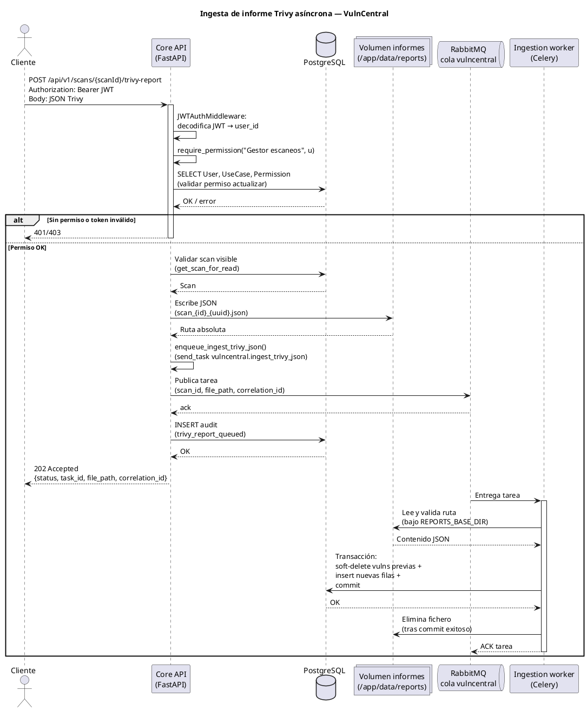
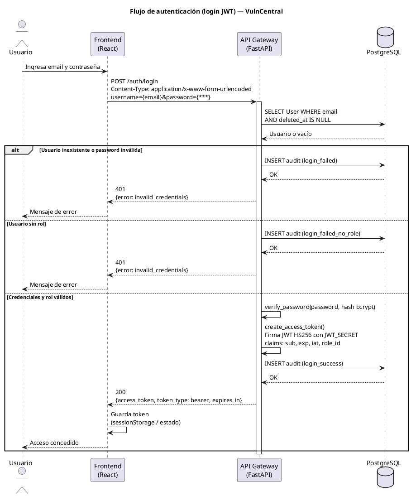
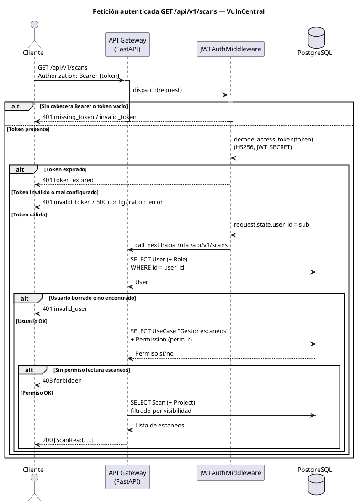
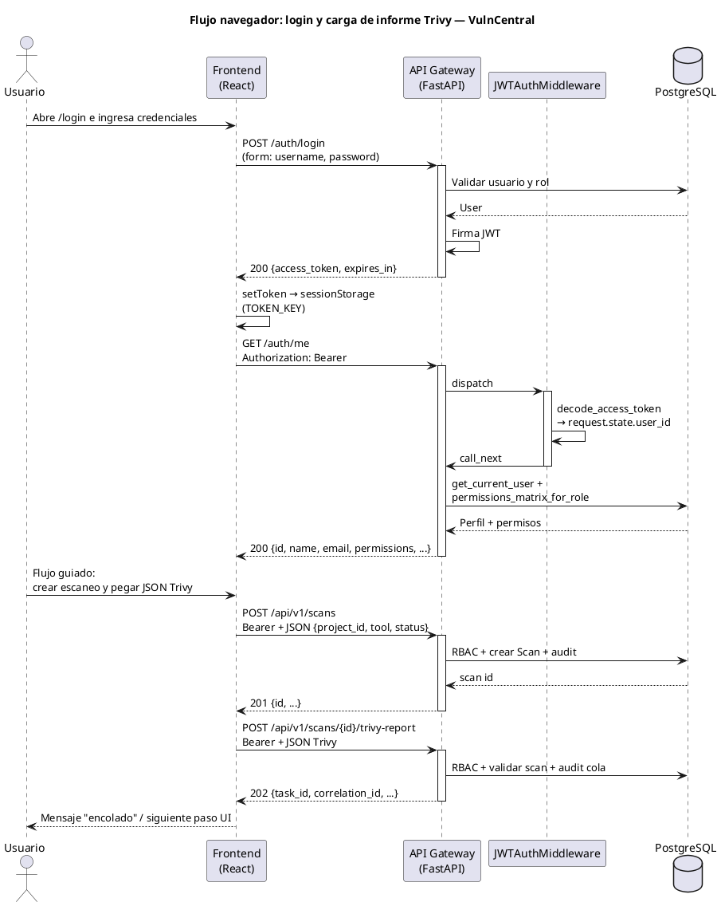
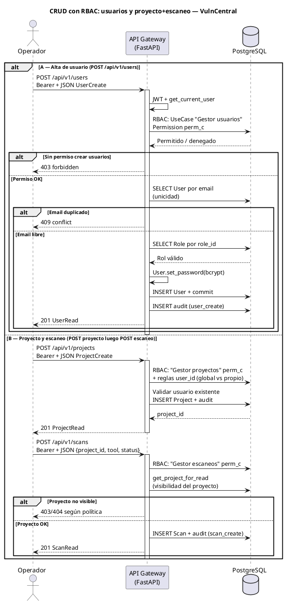

# Diagramas UML de secuencia (PlantUML) — VulnCentral

Este documento recoge **diagramas de secuencia** en sintaxis [PlantUML](https://plantuml.com/sequence-diagram) alineados con la implementación del repositorio: **Core API (FastAPI)**, **ingestion-worker (Celery)**, **PostgreSQL**, **RabbitMQ**, **volumen compartido de informes** y **frontend (React)**.

**Notas:**

- El login usa **OAuth2 password flow** con cuerpo `application/x-www-form-urlencoded` (`username` = email, `password`). La API responde con **`access_token`** (sin *refresh token*).
- Los JWT se firman con **HS256** y el secreto **`JWT_SECRET`** en el proceso del API (no hay Vault ni HSM en el código).
- Para visualizar: pegar cada bloque `@startuml` … `@enduml` en un renderizador PlantUML o en extensión del IDE.

**Rate limiting:** el endpoint `POST /auth/login` puede estar limitado por **slowapi** según `RATE_LIMIT_LOGIN` en el entorno (no detallado en los diagramas).

---

## 1. Ingesta de informe Trivy (asíncrona)

---

## 2. Autenticación (login JWT)

---

## 3. Petición autenticada a la API (GET /api/v1/… con JWT)

---

## 4. Flujo en el navegador: login + acción (escaneo + informe Trivy)

---

## 5. Alta de usuario y creación proyecto + escaneo (CRUD con RBAC)

---

## Referencias de código

- Login y JWT: [`services/api-gateway/app/api/auth.py`](../services/api-gateway/app/api/auth.py), [`services/api-gateway/app/security/jwt_tokens.py`](../services/api-gateway/app/security/jwt_tokens.py)
- Middleware JWT: [`services/api-gateway/app/middleware/jwt_auth.py`](../services/api-gateway/app/middleware/jwt_auth.py)
- RBAC: [`services/api-gateway/app/rbac.py`](../services/api-gateway/app/rbac.py)
- Ingesta Trivy y escaneos: [`services/api-gateway/app/api/v1/scans.py`](../services/api-gateway/app/api/v1/scans.py)
- Worker: [`services/worker/tasks/tasks.py`](../services/worker/tasks/tasks.py), [`services/worker/trivy_processing.py`](../services/worker/trivy_processing.py)
- Frontend auth y flujo: [`services/frontend/src/context/AuthContext.jsx`](../services/frontend/src/context/AuthContext.jsx), [`services/frontend/src/pages/FlowNewPage.jsx`](../services/frontend/src/pages/FlowNewPage.jsx)
